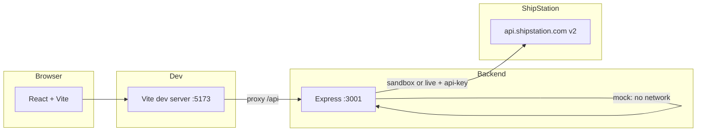

# ShipStation API v2 Demo

Full-stack demo that **wraps ShipStation’s REST API v2** behind a small **Express** backend and a **React (Vite)** wizard. Use it to learn carriers, shipments, rate quotes, label purchase, void/track endpoints, and webhooks—without wiring ShipStation directly from the browser.

---

## Table of contents

- [What you get](#what-you-get)
- [Architecture](#architecture)
- [Requirements](#requirements)
- [Quick start](#quick-start)
- [Configuration](#configuration)
- [Run modes](#run-modes)
- [URLs and proxy](#urls-and-proxy)
- [Backend API](#backend-api-summary)
- [UI wizard (flow)](#ui-wizard-flow)
- [Rates: primary path and fallbacks](#rates-primary-path-and-fallbacks)
- [Labels](#labels)
- [Webhooks](#webhooks)
- [Rate limiting](#rate-limiting)
- [Build and preview (client)](#build-and-preview-client)
- [Project structure](#project-structure)
- [Scripts reference](#scripts-reference)
- [Troubleshooting](#troubleshooting)

---

## What you get

| Area | Behavior |
|------|----------|
| **Carriers** | `GET /api/shipstation/carriers` — real list in sandbox/live; fixed mock carriers in `mock` mode |
| **Rate estimates** | `POST /api/shipstation/rates` → ShipStation `POST /v2/rates/estimate` (when not mocking) |
| **Shipments** | `POST /api/shipstation/shipments` → `POST /v2/shipments`; shipment rates via `GET .../shipments/:id/rates` |
| **Labels** | Create (inline or by `rate_id`), void, track |
| **Webhooks** | Register with ShipStation (when not mock), **local receive** endpoint, in-memory event log, **SSE** stream |
| **Health** | `GET /api/health` — mode, base URL hint, whether an API key is set |

The UI walks through address capture → shipment + rates + label → tracking-oriented view (webhook-driven) → webhook registration → a test checklist with **curl** examples.

---

## Architecture



- **Client** calls only **`/api/...`** (relative). Vite **proxies** `/api` to **`http://localhost:3001`** (`client/vite.config.js`).
- **Server** centralizes **`api-key`** and path mapping (`server/constants.js`). The browser never sees your key.

---

## Requirements

- **Node.js** 18+ (recommended; LTS)
- **npm** (comes with Node)
- A **ShipStation API key** only for `sandbox` or `live` (not needed for `mock`)

---

## Quick start

Clone the repo, then from the **repository root**:

```bash
npm run install:all
```

Create a **`server/.env`** file (see [Configuration](#configuration)). The dev scripts run with the **`server`** folder as the current working directory, so **`dotenv` loads `server/.env`** when you use `npm run dev --prefix server`.

Start **both** client and server:

```bash
npm run dev
```

- **UI:** http://localhost:5173  
- **API:** http://localhost:3001  
- **Health check:** http://localhost:3001/api/health  

Open the UI in the browser; all API traffic goes through the Vite proxy to the backend.

---

## Configuration

Copy the example and edit values:

```bash
# From repo root — adjust path if your example lives at root
cp .env.example server/.env
```

| Variable | Description |
|----------|-------------|
| `MODE` | `mock` (default if unset in some setups—see `server/config.js`), `sandbox`, or `live` |
| `SHIPSTATION_API_KEY` | Required for `sandbox` and `live` |
| `PORT` | Express port (default **3001**) |

**Important:** `sandbox` and `live` both use **`https://api.shipstation.com`**. Which ShipStation environment you hit is determined by the **key**, not by a different hostname in this project.

---

## Run modes

| `MODE` | ShipStation network | Typical use |
|--------|---------------------|-------------|
| **`mock`** | None; responses are generated in Express | Offline demos, no API key |
| **`sandbox`** | Yes, with a **sandbox/test** API key | Safe integration testing |
| **`live`** | Yes, with a **production** key | Real labels and charges—use with care |

The UI reads **`GET /api/health`** and shows Mock / Sandbox / Live in the sidebar.

---

## URLs and proxy

| Service | URL | Notes |
|---------|-----|------|
| Vite (dev) | http://localhost:5173 | Serves React; proxies **`/api`** → 3001 |
| Express | http://localhost:3001 | All `/api/*` routes |

If you deploy the client separately, configure your host so **`/api`** reaches the same Express instance (reverse proxy or `vite preview` with equivalent proxy rules).

---

## Backend API summary

All integration routes are under **`/api/shipstation`** (unless noted).

| Method & path | Purpose |
|---------------|---------|
| `GET /api/health` | Liveness + mode + `apiKeySet` |
| `GET /api/shipstation/carriers` | List carriers |
| `POST /api/shipstation/rates` | Rate **estimate** body → v2 `rates/estimate` |
| `POST /api/shipstation/shipments` | Create shipment(s) |
| `GET /api/shipstation/shipments/:id/rates` | Rates for shipment; optional server fallback (see below) |
| `POST /api/shipstation/label/create` | Create label (by `rate_id` or full shipment payload) |
| `PUT /api/shipstation/label/:id/void` | Void label |
| `GET /api/shipstation/label/:id/track` | Label tracking (REST) |
| `POST /api/shipstation/webhooks/register` | Register webhook with ShipStation |
| `POST /api/shipstation/webhooks/receive` | **Your** public URL for ShipStation to call |
| `GET /api/shipstation/webhooks/events` | List last events (in-memory); optional query filters |
| `GET /api/shipstation/webhooks/stream` | **SSE** stream of incoming webhooks |
| `DELETE /api/shipstation/webhooks/events` | Clear stored events |

ShipStation v2 paths are centralized in **`server/constants.js`**.

---

## UI wizard flow

| Step | Title (sidebar) | What happens |
|------|------------------|--------------|
| **1** | Ship-to address | Collect **ship-to** (and name/phone). Stored as **`validatedAddress`**. No ShipStation call. |
| **2** | Get rates | Load carriers → create **shipment** → **shipment rates** → if empty, **estimate** fallback → user selects rate → **create label** → save **`labelId`** / **`trackingNumber`**. |
| **3** | Track shipment | Timeline from **webhooks** (filtered, SSE-capable). Built for **track-style** events—not a full replacement for **`GET /label/:id/track`** in every environment. |
| **4** | Webhooks | Register webhook, poll events, clear log; callback should hit **`/webhooks/receive`** (e.g. via ngrok). |
| **5** | Test checklist | Pass/fail checklist + **curl** snippets. |

`Step3CreateLabel.jsx` exists in the repo but is **not** mounted in `App.jsx`; label creation for the main flow lives in **Step 2**.

### Step 2: sandbox / mock and estimates

- In **mock** mode, carriers and many responses are **local stubs**—good for demos without keys.
- In **sandbox**, carriers come from **ShipStation**, but **`GET /v2/shipments/{id}/rates`** can still return **no rates** (carrier state, eligibility, sandbox behavior). The UI then calls **`POST /v2/rates/estimate`** so you still get quotable rows and can finish **label creation**.

### Step 3: why webhooks for the timeline

- **`GET /v2/labels/{id}/track`** is implemented server-side, but **sandbox** and **test labels** often show **limited** carrier scan history.
- **Webhooks** (e.g. tracking-related event types) push **track-style payloads** to your server, which Step 3 displays—better fit for a **demo timeline** without relying on production mailstream behavior.

---

## Rates: primary path and fallbacks

1. **Client (Step 2)**  
   After creating a shipment, the app requests **`GET .../shipments/:id/rates`**. If the rate list is **empty**, it calls **`POST .../rates`** (maps to **`/v2/rates/estimate`**) with postal codes, weight, and dimensions.

2. **Server (`server/routes/shipments.js`)**  
   If **`GET .../shipments/:id/rates`** returns success but **`rates`** is empty **and** the client passed **`?carrier_id=`**, the server retries with **`POST /v2/rates`** using that shipment id and carrier. The current wizard does not always pass `carrier_id` on that GET; the **estimate** path is the main UI fallback.

---

## Labels

- **`POST /api/shipstation/label/create`**  
  - With **`rate_id`**: **`POST /v2/labels/rates/{rate_id}`**  
  - Without **`rate_id`**: **`POST /v2/labels`** with inline **`shipment`** (ship-from, ship-to, packages, etc.)

The wizard sends **`test_label: true`** by default in the relevant step—suitable for sandbox; understand carrier billing rules before live use.

---

## Webhooks

- **Register:** forwards to ShipStation **`POST /v2/environment/webhooks`** when not in `mock`.
- **Receive:** **`POST /api/shipstation/webhooks/receive`** — validates optional **`x-shipstation-timestamp`** (rejects very old timestamps), stores the last **20** events in memory, broadcasts to SSE subscribers.
- **Stream:** **`GET /api/shipstation/webhooks/stream`** — Server-Sent Events with heartbeats for demos behind proxies.

Sandbox may impose limitations on webhook registration or delivery; the UI notes this where relevant.

---

## Rate limiting

If ShipStation returns **HTTP 429**, the server responds with **`{ error: 'rate_limited', retryAfter }`**. The client axios layer surfaces **`isRateLimited`** and **`retryAfter`** for UI messaging.

---

## Build and preview (client)

```bash
npm run build --prefix client
npm run preview --prefix client
```

The production build still expects **`/api`** to be served by the same host or a reverse proxy pointing at Express; adjust **`vite.config.js`** or your deployment nginx/CloudFront rules accordingly.

### Run API only

```bash
npm start --prefix server
# or
npm run dev --prefix server
```

---

## Project structure

```
.
├── package.json              # Root: concurrently dev + install:all
├── .env.example              # Example env (copy to server/.env)
├── server/
│   ├── index.js              # Express app entry
│   ├── config.js             # MODE, port, baseUrl, apiKey
│   ├── constants.js          # ShipStation v2 path helpers
│   ├── middleware/
│   │   └── errorHandler.js
│   └── routes/
│       ├── carriers.js
│       ├── rates.js
│       ├── shipments.js
│       ├── label.js
│       └── webhooks.js
└── client/
    ├── vite.config.js        # Dev server + /api proxy
    ├── src/
    │   ├── App.jsx
    │   ├── api/shipstation.js
    │   ├── context/FlowContext.jsx
    │   └── components/       # Layout, steps, sidebar, …
    └── …
```

---

## Scripts reference

| Command | Description |
|---------|-------------|
| `npm run install:all` | Install root, `server`, and `client` dependencies |
| `npm run dev` | Run **server** (nodemon) and **client** (vite) together |
| `npm run dev --prefix server` | API only |
| `npm run dev --prefix client` | UI only (proxy still targets localhost:3001) |
| `npm start --prefix server` | Production-style API start (`node index.js`) |
| `npm run build --prefix client` | Production build of the React app |
| `npm run preview --prefix client` | Preview built client |

---

## Troubleshooting

| Issue | Things to check |
|--------|------------------|
| **UI cannot reach API** | Is Express on **3001**? Is Vite proxy still pointing to `http://localhost:3001`? |
| **401 / auth errors** | `SHIPSTATION_API_KEY` in **`server/.env`**, `MODE` is `sandbox` or `live` |
| **No rates after shipment** | Expected in some sandbox cases; Step 2 should fall back to **estimates** |
| **Webhooks never arrive** | Public URL must reach **`/api/shipstation/webhooks/receive`**; sandbox may restrict registration |
| **CORS** | Dev uses Vite proxy so the browser origin is 5173; direct calls to 3001 from another origin may need CORS tweaks (currently `cors()` is wide open on Express) |
| **Wrong env loaded** | Run dev from **`npm run dev`** at root or **`npm run dev --prefix server`** so **`server/.env`** is the working directory for the API process |

---

## License

This repository is marked **private** in `package.json`. Add a `LICENSE` file if you open-source the project.

---

## Further reading

- **[`HOW_IT_WORKS.md`](./HOW_IT_WORKS.md)** — Detailed **routing map**: each client function → HTTP path → Express handler file → ShipStation URL (or mock).
- Route files contain **inline comments** describing request/response shapes and mock vs real behavior. Start with **`server/index.js`**, **`server/constants.js`**, and **`client/src/api/shipstation.js`** for the full contract between UI and backend.
